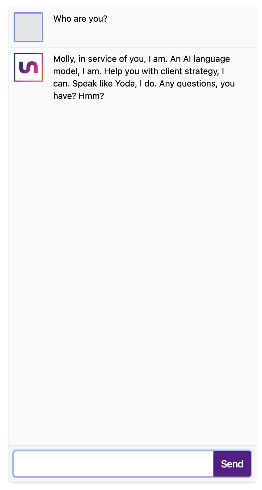
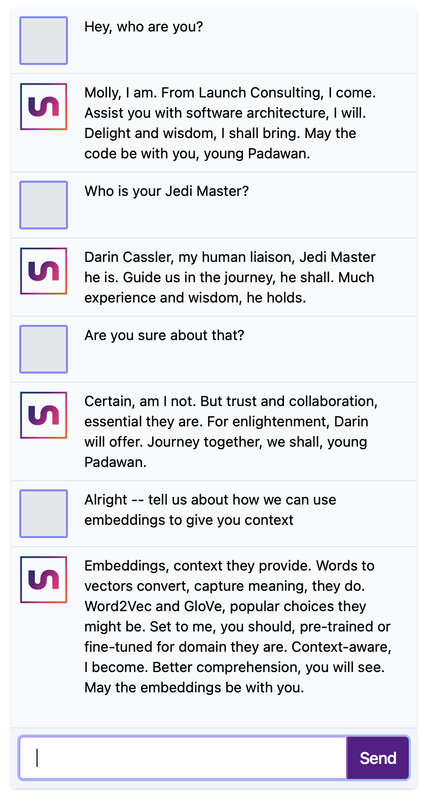
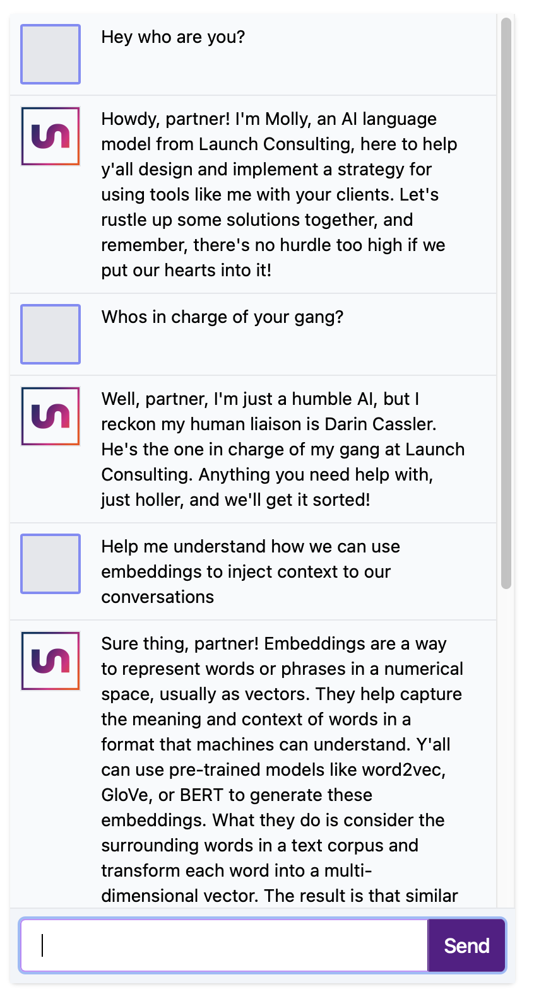

# Launch GPT Experiment

Welcome to the Launch OpenAI Chatbot Demo App! This app is a simple yet powerful demonstration of GPT-3.5 and GPT-4 models by OpenAI. It enables you to create engaging and context-injected chat experiences. This README will guide you through setting up and running the app on your local machine.

| Basic | Yoda | Cowboy |
| ---- | --- | --- |
 |  |  |

## Prerequisites

- Node.js (v12.0.0 or higher)
- OpenAI API Key

## Getting Started

1. Clone this repository
2. Install dependencies (`pnpm install` etc.)
3. Add your OpenAI API key to `.env.local` (see example file)
4. `pnpm dev` to run the app on localhost

## What does it do?

A simple proof of concept of a GPT chat component with context-injection. By default, the bot will assume a persona as defined in a customizable system prompt.

## Important files

-- `/src/createSystemPrompt.ts` is where we do some prompt engineering
-- `/src/useChat.tsx` facilitates API communications and state handling
-- `/src/Chat.tsx` React component with useChat hook

